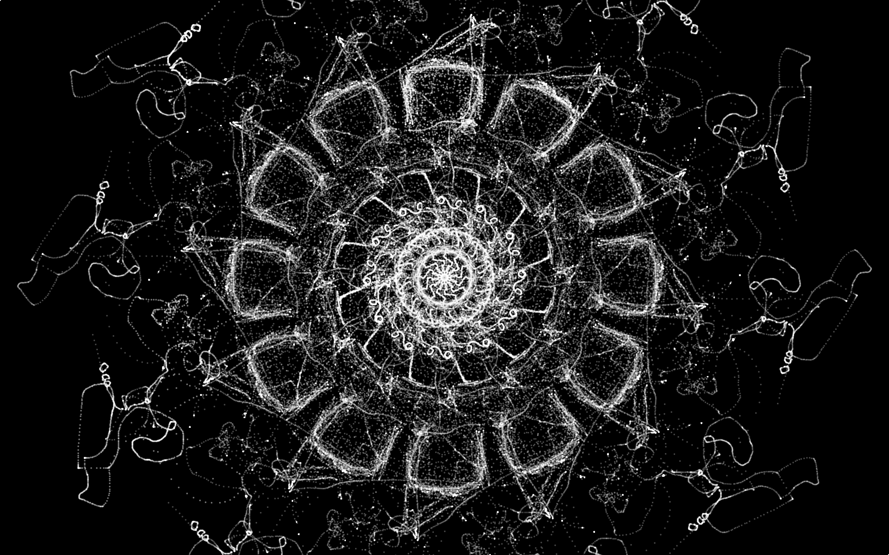
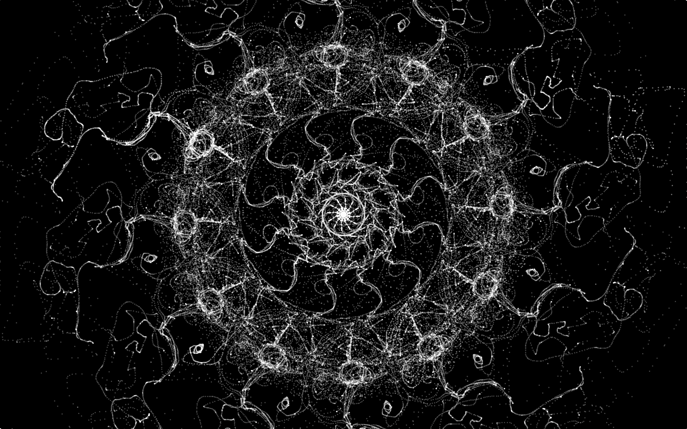

# Workshop_processing_PCD2019
Code for the processing workshop @stereolux for the processing community days 2019

Vous pouvez retrouver l'ensemble du code et de ces explications sur ce dépot [github](https://github.com/AtelierNum/workshop_processing_PCD2019)

Processing est une plateforme logicielle libre et gratuite pour l’apprentissage de la programmation dans le contexte des arts graphiques, créée par Casey Reas et Ben Fry. Elle est complémentée par une version web appelée p5.js, crée par Lauren McCarthy. Aujourd’hui Processing et p5.js sont utilisés de part le monde par une communauté rassemblant artistes, programmeurs, éducateurs et étudiants.

L’un des objectifs de ce projet est de rendre l’apprentissage de la programmation et des œuvres créatives à base de code accessible à toute sorte de communauté, en particulier celle qui sont généralement tenues à l’écart de ces outils et autre ressources. Le premier Processing Community Day (PCD), organisé par Taeyoon Choi et la Fondation Processing en 2017 a été l’un de nos efforts pour améliorer la diversité au sein des communautés de programmeurs et d’artistes. Se déroulant dans les locaux du MIT MediaLab à Boston, PCD 2017 a réuni les membres de la communauté venant en particulier de la côte Est des Etats Unis, leur permettant de se rencontrer « dans la vrai vie », de partager leur travaux, d’apprendre et d’initier de nouvelles collaborations.

En savoir plus sur le PCD 2017 et l’histoire de Processing.
Pour PCD 2019, nous voudrions élargir l’audience et l’impact de cette communauté en s’organisant avec des centaines de Communauté Processing de part le monde. La Fondation Processing organisera le Processing Community Day de Los Angeles et invitera d’autres organisateurs à les rejoindre via d’autres événements et ateliers partout dans le monde.

Lien vers PCD @ worldwide [https://day.processing.org/pcd-ww.html](https://day.processing.org/pcd-ww.html)


## Contenu

* [Un peu d'inspiration](#Un-peu-d'inspiration)

* [Un premier sketch](#Un-premier-sketch)
  * [Les variables](#Les-variables)
  * [Definir les constantes du sketch](#Definir-les-constantes-du-sketch)
* [Les fonctions de base de processing](#Les-fonctions-de-base-de-processing)
  * [Les constantes d'un sketch](#Les-constantes-d'un-sketch)
  * [Dessiner une forme](#Dessiner-une-forme)
  * [Les contours et le remplissage](#Les-contours-et-le-remplissage)
  * [L'aleatoire avec random](#L'aleatoire-avec-random)
  * [Dessiner une forme avec des variables](#Dessiner-une-forme-avec-des-variables)
  * [Les fonctions evenementielles](#Les-fonctions-evenementielles)
  * [Les conditions if](#Les-conditions-if)
  * [les boucles for](#Les-boucles-for)
  * [Sketch final](#sketch-final)
* [Pour aller plus loin](#Pour-aller-plus-loin)


## Un peu d'inspiration : 

  - [Documentation P5 js](https://p5js.org/)
  - [Colorhunt, un site de palettes de couleurs](https://colorhunt.co/)
  - [Site de daniel Shiffman](https://shiffman.net/)

[**home**](#Contenu)

## Premier sketch
### Les variables 
Processing nécessite de déclarer le type des variables. Selon le type, une variable pourra stocker différents types de valeurs et avoir une taille de stockage différente. La valeur d'une variable peut être changée plus tard dans le programme. Ainsi, une variable pourra prendre plusieurs valeurs au cours du programme.

```java
-int // stocke des entiers
-float // stocke des réels 
-double //stocke également des réels, mais peut contenir plus de chiffres après la virgule
```

[**home**](#Contenu)

### Definir les constantes du sketch
Processing utilise une fonction **setup** qui s'exécute une seule fois au lancement du sketch, puis la fonction **draw** prend le relais et est exécutée en boucle jusqu'à l'arrêt du programme.
Il existe aussi des fonctions évènementielles qui s'exécutent de manière momentannée lorsqu'une action est effectuée par l'utilisateur, comme un clic de souris ou une pression d'une touche de clavier.

```java


void setup(){
size(800,800); // taille de la fenetre de dessin
background(0); //couleur du fond
}

void draw(){
// le code à executer en boucle
}

void mousePressed(){
// le code à exécuter lorsqu'un clic de souris est effectué
}

```


[**home**](#Contenu)

## Les fonctions de base de Processing

### Les constantes d'un sketch
Certaines variables peuvent être "globales" ou internes selon l'endroit où elles ont été déclarées.
Une variable déclarée en dehors de toute fonction est considérée comme **globale** et accesible partout dans le sketch. Une variable déclarée dans une fonction, une boucle ou une condition est considérée comme **locale** et n'est accessible que dans cette boucle / variable / condition.

Certaines sont spécifiques à Processing, et utilisables à tout moment, telles que **mouseX, mouseY** qui définissent la position sur les axes x, y de la souris, et **width, height** qui définissent la taille de la fenêtre 

```java
int glob; // voici une variable globale

void setup(){
int loc = 10; // voici une variable locale crée avec une valeur de 10
glob = 10;
}

void draw(){
println(glob); // affiche dans la console la valeur de glob, ici "10"
//si je fais println(loc), Processing me renverra une erreur
}
```


[**home**](#Contenu)

### Dessiner une forme
Une ellipse est définie par 4 paramètres : 
* sa position en x
* sa position en y
* son rayon en x
* son rayon en y

Le rectangle est également défini de la même manière, à la différence près que les deux derniers paramètres correspondent 
à la longueur de ses côtés.

```java
ellipse(50,100,10,10); //une cercle positionné en (50,100) faisant 10px de rayon
rect(50,100,10,10); // un carré positionné en (50,100) faisant 10px de côté
```

[**home**](#Contenu)

### Les contours et le remplissage
Processing définit les contours avec la fonction **stroke()** et le remplissage d'une forme avec **fill()**
En mode RGB (Rouge Vert Bleu), elles nécessitent 3 paramètres correspondant aux trois valeurs de couleur. On peut (si l'on souhaite) ajouter une quatrième valeur pour définir l'opacité (également comprise entre 0 et 255). 
Pour tracer une forme avec un contour, il nous faut également définir son épaisseur avec **strokeWeight()**

```java
stroke(0,10,250,10); // contour avec du bleu presque transparent
strokeWeight(5); // contour avec une épaisseur de 5px
fill(255,0,0,125); // remplissage avec du rouge pur en semi-transparence
```

[**home**](#Contenu)


### L'aleatoire avec random
La fonction **random()** permet de faire intervenir une notion d'aléatoire dans le code. Elle renvoie une valeur aléatoire comprise dans un intervalle à chaque fois qu'elle est appelée. Random prend deux paramètres :
```java
random(10,50); // renvoie une valeur aléatoire entre 10 et 50
```

[**home**](#Contenu)

### Dessiner une forme avec des variables
Plutôt que placer des valeurs fixes lorsqu'on définit une forme, on peut définir celle-ci avec des variables qui pourront etre changées plus tard, permettant que la forme change de taille, couleur, de contour etc...
```java
int positionx = 100; // petit rappel : int stocke des entiers
int positiony = 50;
float taille = 50; // float stocke des réels
ellipse( positionx, positiony, taille, taille ); // un  cercle de 50 de rayon placé en (100,50).
```

[**home**](#Contenu)

### Les fonctions evenementielles
Comme dit plus haut, les fonctions évènementielles s'exécutent lorsqu'une action spécifique est faite par l'utilisateur.
Il existe par exemple de **keyPressed**, qui s'exécute lorsqu'une touche du clavier est enfoncée ou **mousePressed** qui s'exécute lorsque l'utilisateur clique avec la souris.
```java
void keyPressed(){
//le code à executer lorsqu'une touche du clavier est enfoncée
}

void mousePressed(){
// le code à executer
}
```
[**home**](#Contenu)

### Les conditions if 
Des portions de code peuvent ne s'exécuter que dans certains cas, lorsqu'une condition spécifique est définie. Pour cela, on utilise la condition **if()** pour définir cette condition.
```java
if (condition){
// code à executer dans le cas où la condition est valide
}

// un exemple concret : 

if (keyPressed == true){ // la condition est valide si une touche est enfoncée, et dessine un cercle blanc 
fill(255);
noStroke();
 ellipse(150,200,10,10);
}
```
[**home**](#Contenu)

### Les boucles for 

C’est un des point primordiaux de la programmation objet, le boucles permette de répéter une action ou une suite d’instruction un nombre limité de fois. 

```java
for (int i  = 0 ; i < 10 ; i = i + 1){
	noStroke() ;
	fill(255) ;
	ellipse (10 + i * 10, 10 + i * 10, 5,5) ;
}
```

Un boucle for se compose, de deux parties :

* Un bloc d’instructions à exécuter, situé entre les deux accolades.

*  Entre les parenthèses  ce sont les conditions d’exécution de la boucle qui sont séparées par des points virgules.

 Pour l'executer, on définit d’abord un nombre entier appelé « i » que l’on initialise à 0,

* ensuite on précise que l’on exécutera le bloc d’instruction uniquement si  « i » reste strictement inférieur à 10,

* puis on incrémente « i » de 1 en lui ajoutant la valeur 1.

Le code présenté ci-dessus permet donc de dessiner 10 cercles blancs de 5 pixels de diamètre, le premier étant situé en haut à gauche aux coordonnées (10,10), le dernier aux coordonnées (100,100).(100 = 10 + 9*10).

[**home**](#Contenu)


## Sketch final
Avec toutes les notions abordées auparavant, il vous est maintenant possible de créer une rosace créeant des formes trs sympathiques ! 
Petit indice : il est possible de positionner les points avec des coordonnées polaires, mais pour les frileux, il est possible d'éviter celles-ci avec les fonctions de Processing ! Jetez un coup d'oeil sur [le site de Processing](https://processing.org/reference/) pour comprendre les notions de **pushMatrix()** et **popMatrix()**, **translate()** et **rotate()**.




[**home**](#Contenu)

## Pour aller plus loin 
* [https://github.com/b2renger/Introduction_Processing](https://github.com/b2renger/Introduction_Processing)
* [https://shiffman.net/](https://shiffman.net)
* [https://www.youtube.com/user/shiffman](https://www.youtube.com/user/shiffman)
* [https://fr.flossmanuals.net/processing/introduction](https://fr.flossmanuals.net/processing/introduction)

[**home**](#Contenu)
